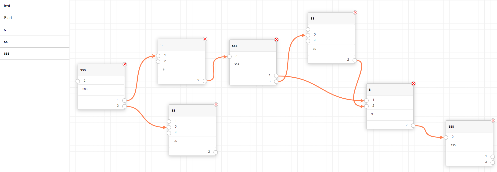

# type strong flowchart

[](LICENSE-MIT)
A simple dynamic flow chart, where only the same type can be connected together.

[](https://github.com/quer/flow-chart-type-strong)

# Features
 * Drag and drop menu modules to the screen
 * Draggable modules
 * Create connection between output and input. ( click output once, and then click input)
 * Remove connections between output and input. ( click a output 2 times)
 * change conneciton between output and 2 input.
 * delete the modules it self.
 * Save all loaded modules
 * Load modules from json object.
 * Only a output and input of same type can be connected.
 * Simple rules to ensure you only do what is possible
 * Show arrow between 2 connctions.
 * the box can have input inside
 * the box can have checkbox inside
 * the box can have radio inside
 * clear all modules.
 * dynamic width on modules ( predefined for each module)
 * simple rule, it will add red border to mandatory input/output/input fields, when saving


# works
The way it works, it will request a url, where it will get the structure of all the boxes, that is going to be able to create. 
I have setup an example in `api.php` where it will retun a json object: 

```js
{
    "moduler": [
        ....
        {
            "ID": 5,
            "Name": "sss",
            "field": [
                {
                    "ID": "1_F_1",
                    "text": "Start",
                    "type": "checkbox",
                    "values": [
                        "HTML",
                        "CSS"
                    ],
                    "mandatory": true
                },
                {
                    "ID": "1_F_2",
                    "text": "GroupID",
                    "type": "input",
                    "mandatory": true
                },
                {
                    "ID": "1_F_3",
                    "text": "What to jump?",
                    "type": "radio",
                    "values": [
                        "yes",
                        "no"
                    ],
                    "mandatory": true
                }
            ]
            "input": [
                {
                    "ID": "5_I_1",
                    "Name": "2",
                    "type": "2"
                }
            ],
            "output": [
                {
                    "ID": "5_O_1",
                    "Name": "1",
                    "type": "1"
                },
                {
                    "ID": "5_O_2",
                    "Name": "3",
                    "type": "3"
                }
            ]
        }
    ],
    "load": "{\"boxes\":[{\"ID\":5,\"RealId\":1,\"x\":\"54px\",\"y\":\"69px\"},{\"ID\":4,\"RealId\":5,\"x\":\"342px\",\"y\":\"71px\"},{\"ID\":3,\"RealId\":10,\"x\":\"626px\",\"y\":\"78px\"},{\"ID\":5,\"RealId\":14,\"x\":\"912px\",\"y\":\"84px\"},{\"ID\":5,\"RealId\":18,\"x\":\"408px\",\"y\":\"445px\"},{\"ID\":4,\"RealId\":22,\"x\":\"851px\",\"y\":\"491px\"},{\"ID\":3,\"RealId\":27,\"x\":\"35px\",\"y\":\"456px\"}],\"connection\":[{\"FromID\":\"5_O_1\",\"FromRealId\":1,\"ToID\":\"4_I_1\",\"ToRealId\":5},{\"FromID\":\"4_O_1\",\"FromRealId\":5,\"ToID\":\"3_I_2\",\"ToRealId\":10},{\"FromID\":\"3_O_1\",\"FromRealId\":10,\"ToID\":\"5_I_1\",\"ToRealId\":14},{\"FromID\":\"5_O_1\",\"FromRealId\":18,\"ToID\":\"3_I_1\",\"ToRealId\":27},{\"FromID\":\"5_O_2\",\"FromRealId\":18,\"ToID\":\"4_I_2\",\"ToRealId\":22},{\"FromID\":\"4_O_1\",\"FromRealId\":22,\"ToID\":\"5_I_1\",\"ToRealId\":18},{\"FromID\":\"3_O_1\",\"FromRealId\":27,\"ToID\":\"5_I_1\",\"ToRealId\":1}]}"
}
```
### Load modules that can be used. 
here we defind what boxes exist, in the example above. we create a box whit a uniq id `5` and a name. 
Then we defind what it will take as input. For each input wee need to set a uniq id, and a name to show in the ui. then we need to tell what type it will take. here in the example it will take `2`, then only a output of type `2` will be able to be connected.
The same will be made for the ouputs.
Also you can defind what input field, that also shoud be in the module. At the monent there is only 3 types of input `checkbox` `input` `radio`. the posibal values for `checkbox` and `radio` shoud be defiend in the `values` tag as a list. 

As seen in the example, that box will have 1 input of type `2` and 2 output of type `1` and `3`

### Save modules
Click the save button, and then in the console, it will have loged a json obj, where the hole loaded modules will be in. 
Read the `Preload modules` section to know what it does. 
to use that as the Preload modules, all you have to do, it to `JSON.stringify` that JSON object. and place that in the api.php in the Load section.


### Preload modules
To be able to preload modules, the `load` must be set. in the example above here, i have stringify some json. it will be showen as Json below. 
Here we can see a list of all the boxes that it will create. in the tag `boxes`. In the example below. it will create a box of ID `5` and `3` at thoes pos. And store the id (`RealId`) on that box.
Then in the connections we defind how it is connection between the input and output, and what box to what box.
The field export works, as it will have a `fieldID` and stored the index of the seleced `checkbox` or `radio`. or value if it type of `input`.

The way it works is, it take the `FromRealId` (1) and find the box whit that `RealId` and then in that box fid the output whit ID `5_O_1` and then find the box whit `RealId` that is `ToRealId` (10). And in that box find input whit ID `3_I_1`

```js
{
    "boxes": [
        {
            "ID": 5,
            "RealId": 1,
            "x": "684px",
            "y": "169px",
            "fields": [
                {
                    "fieldID": "1_F_1",
                    "checked": [
                        0,
                        1
                    ]
                },
                {
                    "fieldID": "1_F_2",
                    "value": "asd"
                },
                {
                    "fieldID": "1_F_3",
                    "checked": 1
                }
            ]
        },
        {
            "ID": 3,
            "RealId": 10,
            "x": "1270px",
            "y": "358px"
        },
        ...
    ],
    "connection": [
        {
            "FromID": "5_O_1",
            "FromRealId": 1,
            "ToID": "3_I_1",
            "ToRealId": 10
        },
        ...
    ]
}
```
